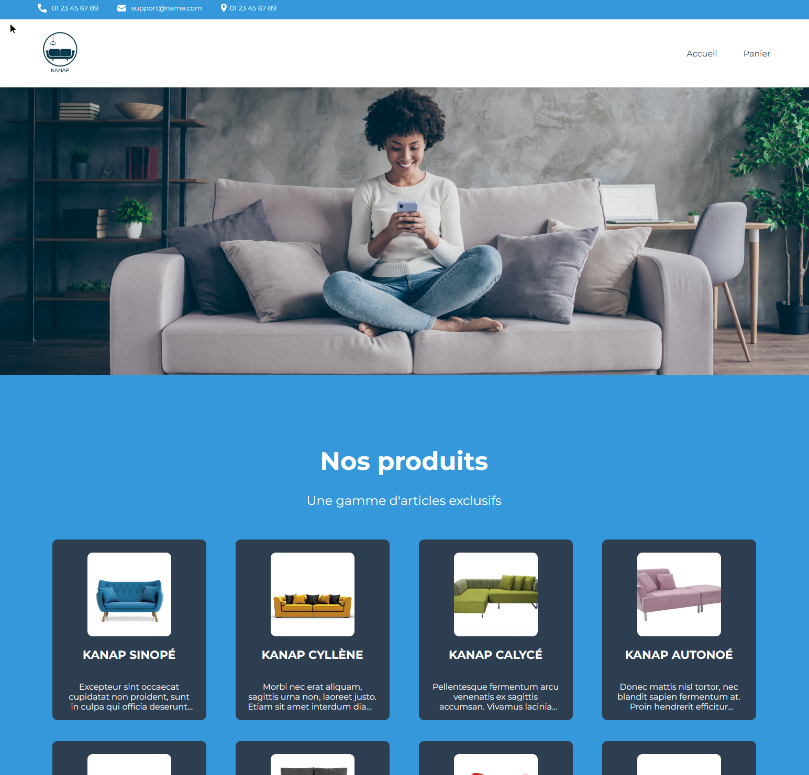

# KANAP

## Projet 5 du parcours Développeur Web d'Openclassrooms.

Kanap est une marque de canapés qui vend ses produits depuis sa boutique exclusivement.
Celle-ci souhaiterait avoir une plateforme de e-commerce en plus de sa boutique physique pour
vendre ses produits sur Internet.

## Objectifs

- Intégrer dynamiquement les éléments de l’API dans les différentes pages web avec JavaScript.
- Mettre en place un plan de test d’acceptation.

## Front end

- Pour démarrer la page d'accueil, il faut utiliser un serveur local comme le plugin live server sur vs code.
- Démarrer live server depuis la page index.html.

## Back end

- Node et npm doivent être installés localement sur la machine.
- Cloner ce repo.
- Effectuer un `npm install` depuis le dossier back.
- Puis y démarrer le serveur avec la commande `node server`.
- Le serveur va fonctionner sur `localhost` avec le port par défaut `3000`, ou un autre si besoin qui sera indiqué dans la console `Listening on port 3001`.
